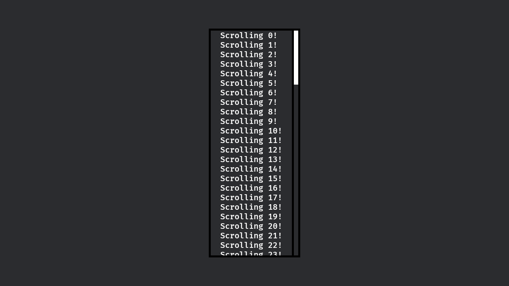

# Bevy Scrollbar

Bevy plugin providing a scrollbar.

## Usage

Check out the documentation homepage or look at [example_1.rs](examples/example_1.rs).

## Scope

This project simply aims to support scrollbars in small Bevy projects until Bevy does it natively. So the scope is small. Adding horizontal scrollbars would be the next (and likely final) goal.

## Contributions

Feel free to open a small PR.

## Bevy compatibility

| `bevy_scrollbar` | `bevy` |
| :--              | :--    |
| `0.1`            | `0.16` |
